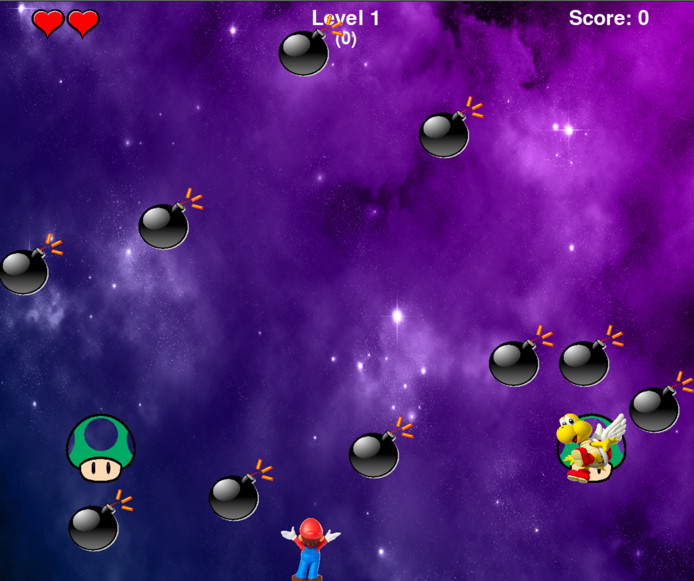
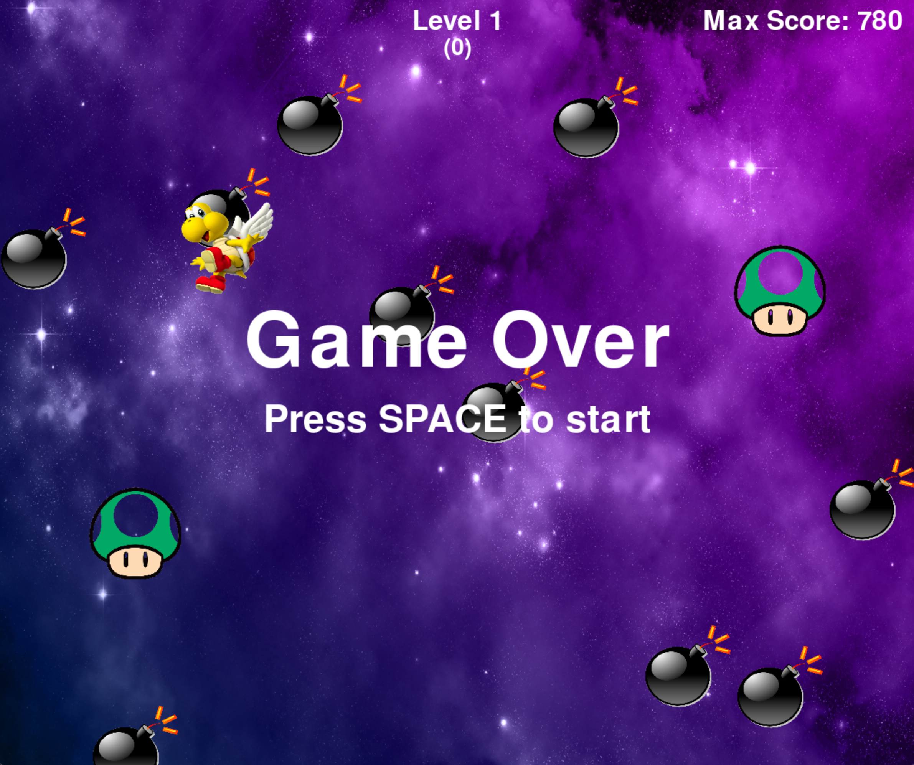
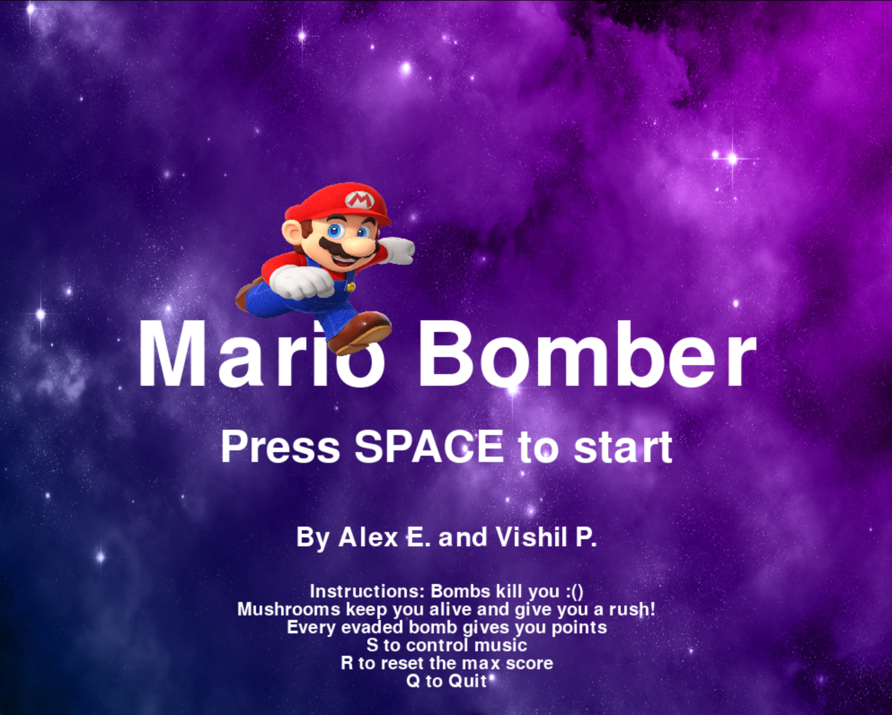
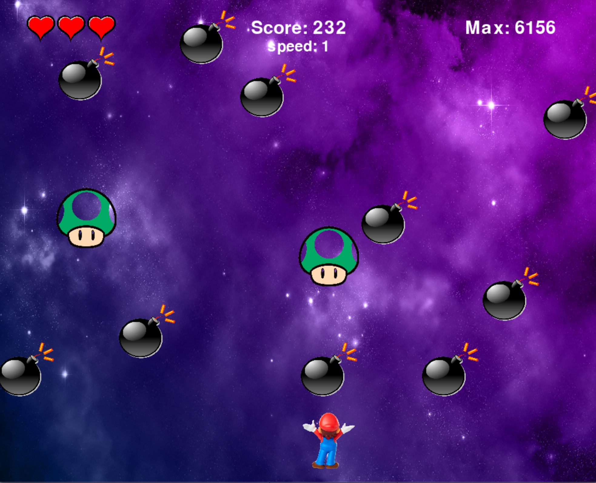
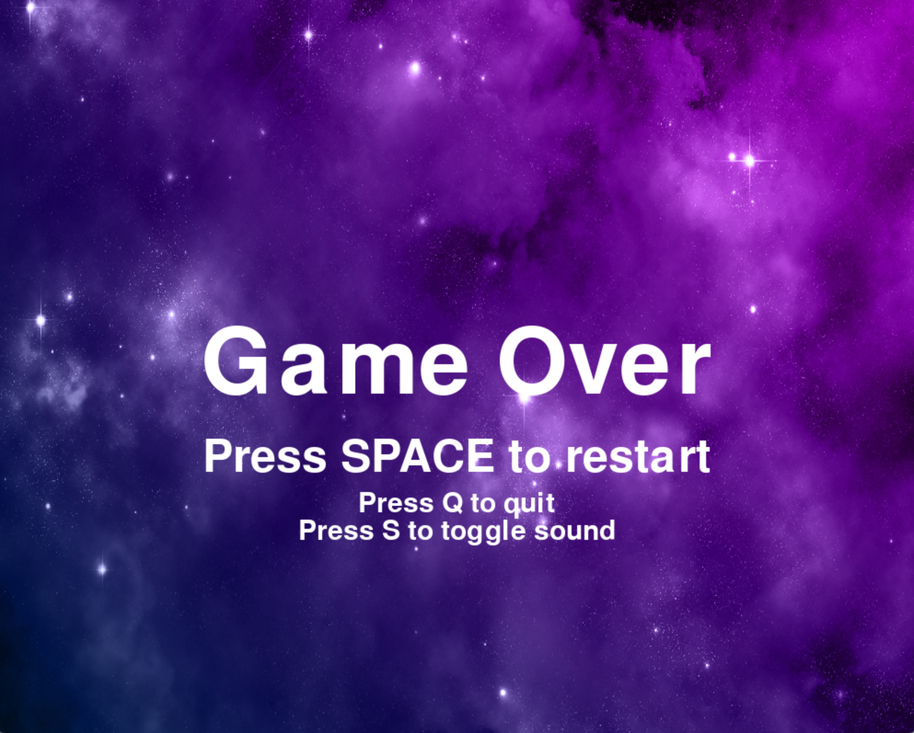
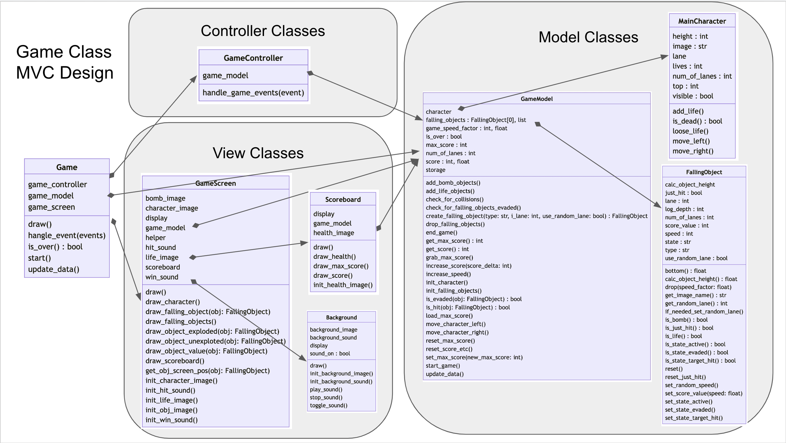
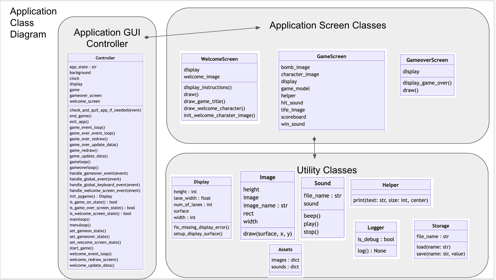

# CS110 Final Project Proposal
# Mario Bomber
## CS 110 Final Project
### Fall 2022
### [Assignment Description](https://docs.google.com/document/d/1H4R6yLL7som1lglyXWZ04RvTp_RvRFCCBn6sqv-82ps/edit?usp=sharing)

*Links to resources:*

* [Link to Replit](https://replit.com/join/lpjkntmecg-alexeskenazi)

* [Link to Github](https://github.com/bucs110FALL22/final-project-alex-and-vishil)
* [link to demo presentation slides](https://docs.google.com/presentation/d/1hdOnsbMrEI_zL2kYNDxttRJsh1tChDJkDEUE86m8mDA/edit?usp=sharing)

### Team: Alex and Vishil
#### Team Members
 * Alex Eskenazi
 
 * Vishil Patel


## Project Description

* An arcade game written in Python using Pygame as a GUI framework.
* Mario bomber is a game where bombs and other items rain down from the sky
* Mario, the character, has to avoid the harmful bombs raining from the sky.
* Raining mushrooms give Mario an extra life, but make the game go faster.
* The longer the character stays alive the more points you receive.
* In addition to the GUI, the game has a sound track and sound effects.


### Requirements:

#### Must Have
* Character moves horizontally with keyboad :white_check_mark:
* At least one type of item rains down. :white_check_mark:
* Item kills character on collision. :white_check_mark:
* Game restart :white_check_mark:
* Game quit :white_check_mark:

#### Nice to Have
* Lives are counted :white_check_mark:
* Game over on losing all lives :white_check_mark:
* Scoring sytem :white_check_mark:
* Prize items :white_check_mark:
* Sound effects :white_check_mark:
* Background soundtrack :white_check_mark:

#### Dream
* Different Levels
* Character choice.
* Score board :white_check_mark:
* Variety of power ups with different effects
* Boss fight - skill challenge to pass on levels
* Multiplayer

#### Additional Requirements
Requirements added after proposal:
* Welcome screen  :white_check_mark:
* Game over screen :white_check_mark:
* Max score :white_check_mark:
* Max score preserved in a file (data permanence) :white_check_mark:
* Variable speed and speed indicator :white_check_mark:

:white_check_mark: Represents  fullfilled requirements

***    

## User Interface Design

- **Initial Concept**

  - **Initial Welcome Screen:**[Welcome Screen](etc/alexvishil_welcome_screen.png)
  - **Initial Game Screen:**
  - **Initial Game Over Screen:**
    
    
- **Final GUI**
  - **Final Welcome Screen:**
  - **Final Game Screen:**
  - **Final Game Over Screen:**

***        

## Program Design

* **Python libraries and tools**
   - [Pygame](https://www.pygame.org/docs/) - provides the graphing and event framework for the game.
   - [shelve](https://docs.python.org/3/library/shelve.html) - is a persistent, dictionary-like object for data permanence.
   - [os](https://docs.python.org/3/library/os.html) - provides a portable way of using operating system dependent functionality
   - [random](https://docs.python.org/3/library/random.html) - implements pseudo-random number generators for various distributions.
   - [pyreverse](https://pylint.pycqa.org/en/latest/pyreverse.html) - analyzes your source code and generates package and class diagrams.
     
* **Class Interface Design** 
    * Command to locally generate the class diagram using pyreverse:
      ```
       pyreverse -o html ./src/*.py
      ```
        * Game MVC Class Diagram
        *  Application Class Diagram 
* **Classes**
    * **Assets** - translates between in game assets name to the file path to load the asset.
    * **Background** - Responsible for the appication and in game background image and soundtrack.
    * **Charater** - Model representing the main game character.
    * **Controller** - Application level controller.
    * **Display** - Wrapper around pygame to initialize it and hold the surface object.
    * **FallingObject** - Model representing an object falling from the top of the screen.
    * **GameController** - Controller for the game itsefl.
    * **GameModel** - Model for the game.
    * **GmmeScreen** - View for the game.
    * **Game** - Main object tied the game MVC.
    * **GameOverScreen** - View for the game over screen.
    * **Helper** - Utility helper wrapper around pygame to display text on the screen.
    * **Image** - Utility helper wrapper around pygame to display images on the screen.
    * **Logger** - Utility used during debugging to output to the console.
    * **Scoreboard** - View for the scoreboard during the game
    * **Sound** - Utility helper wrapper around pygame to play sounds during the game.
    * **Storage** - Utiliyt helper to save and load information to a file
    * **WelcomeScreen** - View for the initial application screen.

## Project Structure and File List

The Project is broken down into the following file structure:

* main.py
* src
    * assets.py
    * background.py
    * character.py
    * controller.py
    * display.py
    * falling_object.py
    * game_controller.py
    * game_model.py
    * game_screen.py
    * game.py
    * gameover_screen.py
    * helper.py
    * image.py
    * logger.py
    * scoreboard.py
    * sound.py
    * storage.py
    * welcome_screen.py
* assets
    * bomb.png
    * button-3.wav
    * button-10.wav
    * character.png
    * extra-life.png
    * heart.png
    * jungle-run-01.mp3
    * main-character.png
    * space-background.png
      
* etc
    * alexvishil_game_screen.png
    * alexvishil_gameover_screen.png
    * alexvishil_welcome_screen.png
    * class_diagram.html
    * game_class_diagram.png
    * app_class_diagram.png
    * mario_storage.txt (temp runtime file for storing highers score)
    * milestone2.md

***

## Tasks and Responsibilities 

   * Alex Eskenazi - Project Lead and Developer
   * Vishi Patel - Developer
   * Design - Alex Eskenazi
   * Front end - both Alex and Vishil
   * Back end - both Alex and Vishil
   * Data Permanence - Alex
   * Keyboard input - Vishil
   * Application Testing Procedure (ATP) - Vishil
   * Class Diagrams - Alex
   * Sounds - Alex
   * Readme and Demo slides - Alex and Vishil
   * Testing - Alex and Vishil
     

## Testing

* Periodically execute all test scenarios outlined in the ATP below.
* When a test is passed the test is marked as passed or failed in [this google sheet](https://docs.google.com/spreadsheets/d/1MablQK_4zeBLgjPA5U0bhSgzQufty_5_jJ7-jCT0CRc/edit?usp=sharing)
* Helper commands to help in testing:
  * R key resets the highest score to test the highest score persistance.
  * Q key exits the game at any point.
  * S key stops the sound track.
  * O key forces a game over to go to the game over screen quickly
  * G key controls output to the console - used for debugging of specific problems.

## ATP - Acceptance Test Procedure 
* Test in google sheet [here](https://docs.google.com/spreadsheets/d/1MablQK_4zeBLgjPA5U0bhSgzQufty_5_jJ7-jCT0CRc/edit?usp=sharing)

| Step | Procedure                                                              | Expected Result                                                                                        |
| ---- | ---------------------------------------------------------------------- | ------------------------------------------------------------------------------------------------------ |
| 1    | Run the program                                                        | Application opens and welcome screen appears                                                           |
| 2    | Welcome screen - no action needed                                      | Welcome screen Space background displays                                                               |
| 3    | Welcome screen - no action needed                                      | Welcome screen shows static character image partially overlapping the title                            |
| 4    | Welcome screen - no action needed                                      | Game name, credits, and basic instructions are displayed                                               |
| 5    | Welcome screen - no action needed                                      | Background music is playing (locally not on Replit)                                                    |
| 6    | Welcome screen - Press s key while music is off                        | Music starts (note - music does not work on Replit, only on local                                      |
| 7    | Welcome screen - Press s while music is on                             | Music stops (note - music does not work on Replit, only on local                                       |
| 8    | Welcome screen - Press R                                               | The max score is reset to zero - you will be able to tell when the game is start pressing S            |
| 9    | Welcome screen - Press q                                               | Applicaiton cleanly exits                                                                              |
| 10   | Run the program to display the welcome screen                          | Application opens and welcome screen appears                                                           |
| 11   | Welcome screen - Press Space bar                                       | Game starts, the game screen shows and object start falling from the top to the bottom                 |
| 12   | Game - no actions needed                                               | Bombs come down on every lane at different (random) speeds                                             |
| 13   | Game - no actions needed                                               | Two 'lives' (mushrooms) come down along with the bombs                                                 |
| 14   | Game - no actions needed                                               | Character (Mario) displays at the bottom                                                               |
| 15   | Game - no actions needed                                               | Space background remains                                                                               |
| 16   | Game - Press Arrow Left                                                | Character moves to the left                                                                            |
| 17   | Game - Press Arrow Right                                               | Character moves to the right                                                                           |
| 18   | Game - Press Arrow Left multiple times                                 | When character reaches the left border it reapears on the right side                                   |
| 19   | Game - Press Arrow Right multiple times                                | When character reaches the Right border it reapears on the left side                                   |
| 20   | Game - Falling Items                                                   | When falling items reach the bottom they reappear at the top with new random speed                     |
| 21   | Game - Falling mushrooms                                               | When falling mushrooms reach the bottom they reapear at the top in random lanes with new random speeds |
| 22   | Game - character hits bomb                                             | Character loose one live - hearts in the scoreboard indicating the number of lives decrease            |
| 23   | Game - character hits bomb                                             | A sound is played and the word "BOOM!" appears in place of the bomb                                    |
| 24   | Game - toggle background music (press s key)                           | Sound of the character hitting a Bomb or a Mushroom still plays regardless of the music playing        |
| 25   | Game - hit multiple bombs for number of lives to reach zero            | Lifes indicator on the scoreboard shows zero lives                                                     |
| 26   | Game - character looses all lives                                      | Game over screen is displayed                                                                          |
| 27   | Game - character hits Life (mushroom)                                  | A sound is played and the word "Life!" appears in place of the bomb                                    |
| 28   | Game - character hits Life (mushroom)                                  | Game speed is increased and Speed indicator on the scoreboard updates                                  |
| 29   | Game - bomb reaches bottom                                             | The bomb score is displayed instead of the bomb                                                        |
| 30   | Game - bomb reaches bottom                                             | The game score is increased by the value of the bomb                                                   |
| 31   | Game - bomb reaches bottom                                             | The bomb reapears at the top of the screen with the same speed                                         |
| 32   | Game - mushroom reaches bottom                                         | Mushroom reapears at the top in a new lane                                                             |
| 33   | Game - Score Board - no action needed                                  | Score board shows while game is on                                                                     |
| 34   | Game - Score Board - Lives - game start                                | Score board shows 3 lives at the begining                                                              |
| 35   | Game - Score Board - Lives - lives reach zero                          | Game ends and game over screen is displayed                                                            |
| 36   | Game - Score Board - Play game                                         | Score updates in score board as unexploded bombs reach the bottom of the screen                        |
| 37   | Game - Score Board - During first game                                 | After intial run scoreboard Max Score shows 0 (it can be reset to 0 by pressing R)                     |
| 38   | Game - Score Board - Second and subsequent times the game is played    | As new games are played while the app is runnin the max score is updated accordingly                   |
| 39   | Game - Score Board - Close the app and re-run the game                 | The max score is from the last run is restored                                                         |
| 40   | Game - Press R                                                         | The max score is reset to zero                                                                         |
| 41   | Game - Press S when music is off                                       | Music starts (note - music does not work on Replit, only on local                                      |
| 42   | Game - Press S when music is on                                        | Music stops (note - music does not work on Replit, only on local                                       |
| 43   | Game - Press Q                                                         | Application exits                                                                                      |
| 44   | Game - Press O                                                         | Game over screen is displayed                                                                          |
| 45   | Game - Press O                                                         | Partial score does not count towards maximum score                                                     |
| 46   | Game Over screen - no action needed                                    | Space background remains                                                                               |
| 47   | Game Over screen - no action needed                                    | Game over text and key instructions are displayed                                                      |
| 48   | Game Over - Press Space                                                | Restarts the game - Max score is updated acordingly                                                    |
| 49   | Game Over - Press Q                                                    | Application exits                                                                                      |
| 50   | Game Over screen - Press S when music is off                           | Music starts (note - music does not work on Replit, only on local                                      |
| 51   | Game Over screen - Press S when music is on                            | Music stops (note - music does not work on Replit, only on local                                       |
| 52   | Game Over scren - Press R                                              | The max score is reset to zero the next time the game is started                                       |
| 53   | Close the game,delete the file mario\_storage.txt, play the game again | The game should run without problems and a new mario\_storage.txt files should be created              |